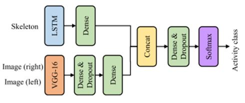
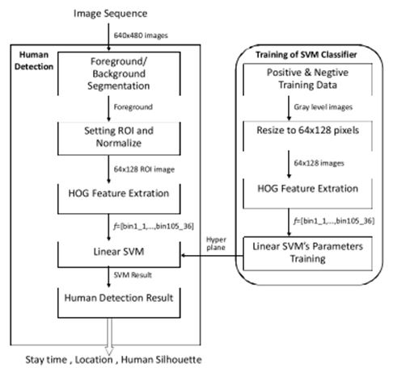
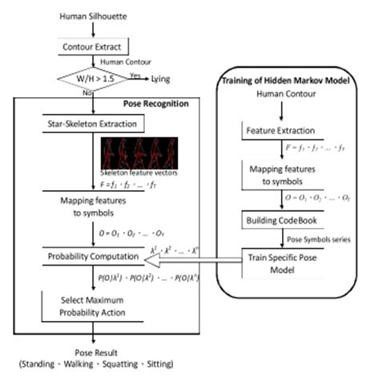

# Literatür Araştırması Raporu

## Human Activity Recognition for Mobile Robot 

https://www.researchgate.net/publication/322675054_Human_Activity_Recognition_for_Mobile_Robot

Makalede konvolüsyonel sinir ağları (KSA) kullanılarak bir mobil robota insan hareketlerini algılatmak amaçlanmıştır. İnsan hareketlerini algılamak için derinlik kamerası kullanmak yerine Vicon hareket algılama sistemleri kullanılmıştır. Bu nedenle makalede belirtilen çalışmada herhangi bir görüntü işleme yapılmadığı görülmektedir. Bahsedilen KSA modeli, iki adet bir bouytlu konvolüsyonel katman, bir adet max pooling katmanı, bir adet tam bağlı katman ve bir adet de Softmax katmanından oluşmaktadır. KSA burada sadece insanın yaptığı hareketi sınıflandırmak için kullanılmıştır. Hareketleri algılamak için de iki bacak, iki kol, bir kafa ve bir omuzdan alınan hareket verileri kullanılmıştır. Bununla beraber KSA modelini eğitmek için ise Vicon’un sunduğu VMCUHK veri seti kullanılmıştır. KSA modeli tahmini el sıkma, kafalama, zıplama, koşma, oturma, ve yürüme sınıfları üzerinedir. Modelin yaptığı tahminler ile çıkan F1 skor sonucu %95.70 olarak hesaplanmıştır.

## Human Activity Recognition with Deep Reinforcement Learning using the Camera of a Mobile Robot

https://ieeexplore.ieee.org/abstract/document/9127376

https://sci-hub.se/10.1109/PerCom45495.2020.9127376

Makalede yapılan çalışmanın amacı Reinforcement Learning (RL) kullanarak robotlar ile insan hareketlerini algılamaktır. İnsan hareketlerini algılamak için derinlik kamerası kullanılmaktadır. Fakat söz konusu çalışma robot olduğu için çalışma iki konudan bahsetmektedir. Birincisi robotu insan hareketini algılayabilmek için robotu olabilecek en uygun lokasyona getirmektir. İkincisi ise derinlik kamerası ile insan hareketlerini algılamaktır. Bahsedilen işlemleri gerçekleştirebilmek için görüntüden insan iskeleti elde edilmelidir. Bunu başarabilmek için OpenPose isimli açık kaynak olan görüntü işleme kütüphanesi kullanılmıştır. Bu kütüphane ile yapılan çalışmalarda insan vücudu 25 eklem noktasına ayrılmaktadır. İnsan hareketlerini algılamak için kullanılan yapay sinir ağları modeli şu şekildedir:

İnsan hareketleri yemek hazırlama, çay yapma, meyve suyu yapma, bulaşık yıkama, kitap okuma, telefon kullanma, telefonda konuşma, yemek yeme, televizyon izleme, diş fırçalama, yüz yıkama ve uyumak olacak şekilde sınıflandırılmıştır. OpenPose kütüphanesinden elde edilen veriler LSTM katmanına, 64x64 lük el görüntüleri de VGG-16 konvolüsyonel sinir ağı (KSA) katmanına verilmektedir. İkisinden de elde edilen sonuçlar birleştirilip Softmax katmanıns verildikten sonra insan hareketi olarak sınıflandırılmaktadır. Robot insanı elde edilen görüntünün ortasında tutmaya çalışmaktadır ve insana belirli bir mesafeden bakmaktadır. Robotun lokasyonu ve pozisyonu tamamen derin Q-network ile belirlenir. Bahsedilen Q-network, robotun olamsı gereken lokasyonu insan hareketi algılama sinir ağlarından elde edilen güvenilirlik skoru ile belirlemektedir. Makaledeki çalışmada robotta engellerin bulunduğu bir harita bilgisinin olduğu kabul edilmektedir.

## Robotic Search and Rescue using Human Detection System

https://turcomat.org/index.php/turkbilmat/article/download/1600/1352/2983

Makalede amaç otonom bir robot yapmak değildir. Onun yerine amaç insanların giremediği enkazlara girebilecek uzaktan yönetilebilir bir arama kurtarma robotu yapmak olarak belirlenmiştir. Robot enkaz altında kalan insanları algılamak için PIR sensörü, ultrasonik sensör, gaz sensörü ve mikrodalga sensörü kullanmaktadır. PIR sensörü ile insan sıcaklıkları algılanrken mikrodalga sensörü ile de insan hareketleri algılanmaktadır. Mikrodalga sensörü sadece canlı varlıkların hareketlerini algılayabildiği için enkaz alanında insan bulmada büyük bir fark yaratmaktadır. Robota hareket komutları radyo frekansı ile gitmektedir. Robot üzerinde ayrıca bir kamera bulunmaktadır. Böylece robotu kontrol  eden operator robotu nereye göndereceğini daha iyi anlamaktadır. Robot, sensörlerden gelen bütün verileri bir Raspberry Pi üzerinde toplamaktadır. Ayrıca robotun motor kontrolleri de bu kart üzerinden gerçekleştirilmektedir.

## Duruş ve Hareket Algılama Teknolojileri: Stereo, Uçuş Süresi ve Yapısal Işık Algılayıcılar

https://dergipark.org.tr/tr/download/article-file/416529

Makale bir değerlendirme makalesidir. Stereo, uçus süresi (time of flight) ve yapısal ışık algılayıcılar ile yapılan duruş ve hareket algılama çalışmalarının bir kısmı incelenmiştir. Bununla beraber stereo kamera, time of flight (ToF) kameralar, yapısal ışık kameraları ve gibrit kameralar hakkında bilgi verilmiştir. Stereo kameralarda iki kamera bulunur ve bu iki kameradan alınan görüntü ile derinlik bilgisi elde etmektedir. ToF kameralar, kameradan çıkan ışınların nesneden geri dönmesi ile derinlik bilgisini hesaplamaktadır. Yapısal ışık kameraları ise kızıl ötesi ışık yayan bir teknolojidir. Kinect de bu kamera tipindedir. Kinect insan iskeletini 20 eklem noktası ile çıkarabilmektedir.Kinect v2 ise  insan iskeletini 25 eklem noktası ile çıkarabilmektedir. Makalede hibrit kamera olarak bahsedilen kameralar Leap Motion kameralardır. İnsan elini 2 kamera ve 3 kızıl ötesi ışık ile 12 eklem parçasına bölerek algılamaktadır. Fakat makalenin asıl amacı belirtilen kameralar ile eğitim, robotik, sağlık ve nesne algılama (cisim tanıma, yüz tanıma, hareket sınıflama, hareket tahmin vb.) alanlarında yapılan çalışmaları incelemektir. Eğitim alanındaki çalışmalarında öğretim amaçlı arttırılmış gerçeklik kullanılmaktadır. Robotik alanındaki çalışmalar daha çok insan hareketine göre mobil robotu hareket ettirme üzerinedir. Sağlık alanındaki çalışmalar vücut parçaları ve vücut şemasındaki bozuklukları algılama üzerinedir.

## Human Activity Recognition for Domestic Robots

https://www.researchgate.net/publication/258341805_Human_Activity_Recognition_for_Domestic_Robots

https://sci-hub.se/10.1007/978-3-319-07488-7_27

Makalede yapılan çalışmanın amacı robotik teknolojileri kullanarak yaşlı insanlara yardım etmektir. Bu yardımların yapılabilmesi için de insan hareketlerinin algılanabiliyor olması gerekmektedir. Bu çalışmada insan iskeletini çıkarmak için herhangi bir işlem yapılmamaktadır. Kinect aracılığıyla insan iskeleti otomatik olarak elde edilmektedir. (Bu makaleyi çok anlamadım halbuki işin matematiğine kadar inmiş fakat pek anlayamıyorum. Eklem noktalarına ağırlık vermek için HMM based on Gaussian Mixture Model kullanılıyor. Eğitim için ise Dynamic Bayesian Networks kullanılıyor. Ama kafamda oturtamadım bir türlü. Tekrar dönüp bakacağım.)

## Human Activity Recognition Using a Mobile Camera

https://ieeexplore.ieee.org/abstract/document/6145923

https://sci-hub.se/10.1109/URAI.2011.6145923

Makalede yapılan çalışmanın amacı mobil robot üzerinde bulunan bir kamera ile insan hareketlerinin algılanmasıdır. Bu çalışmada insan hareketleri ayakta durmak, yürümek, oturmak, squat yapmak ve yatmak olacak şekilde sınıflandırılmıştır. İnsan hareketinin algılanabilmesi için ilk olarak insanın algılanması amaçlanmıştır. İnsan algılama algoritması aşağıdaki gibidir:

Bir resimden birkaç tane insan olarak algılanabilir özellik HOG özellik çıkarma algoritması ile çıkarılmaktadır. Bu özelliklerin hangisinin insan olduğunu anlamak için Support Vector Machine (SVM) kullanılmıştır. Resimdeki insan algılandıktan sonra iskeletin çıkarılması için star-skeleton yöntemi kullanılmaktadır ve çıkarılan iskeletten elde edilen bilgiler Hidden Markov Model’de kullanılarak insan hareketi belirlenmektedir. İnsan hareketi algılama işlemi aşağıdaki gibi yapılmaktadır:

Bu yapılan çalışmalarla beraber insan hareketleri sınıflarını genişletmek için nesne algılma da projeye eklenmiştir. Nesne algılama ile insanın hangi nesneler ile hareketi gerçekleştirdiği belirlenmektedir. Bununla beraber insanın hareketi nerede yaptığı bilgisi de elde edilmektedir. Nesne algılama için SURF özellik çıkarma algoritması kullanılmıştır ve elde edilen özellikler için feature matching işlemi uygulanmıştır. Görüntüdeki insanı belirleme başarısı ortalama %95.33, insan hareketini belirleme başarısı ise ortalama %94.8 olarak tespit edilmiştir.